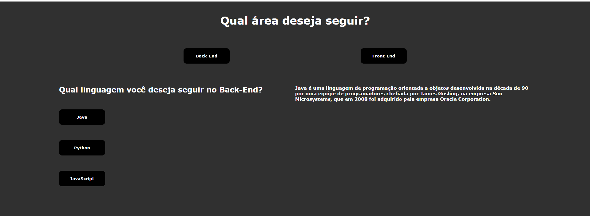

# Formulário de Escolha de Linguagem de Programação



Este projeto é um formulário interativo que permite aos usuários escolher uma linguagem de programação e, com base na escolha, exibe uma descrição e uma imagem da linguagem selecionada. O projeto foi desenvolvido utilizando HTML, CSS e JavaScript.

## Tecnologias Utilizadas

- **HTML**: Para estruturar o conteúdo do formulário e os elementos da página.
- **CSS**: Para estilizar a página e torná-la visualmente atraente.
- **JavaScript**: Para adicionar interatividade e lógica ao formulário.

## Funcionalidades

- Permite que o usuário selecione uma linguagem de programação entre Java, Python e JavaScript. (BACK-END)
- Permite que o usuário selecione uma linguagem de programação entre React, Angular e Vue.js. (FRONT-END)
- Exibe uma descrição da linguagem selecionada.
- Mostra uma imagem associada à linguagem escolhida.

## Como Usar

1. **Clone o repositório**:
   ```bash
   git clone https://github.com/seu-usuario/nome-do-repositorio.git
